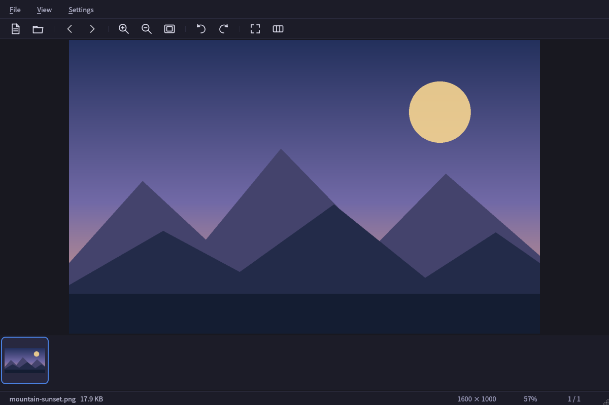
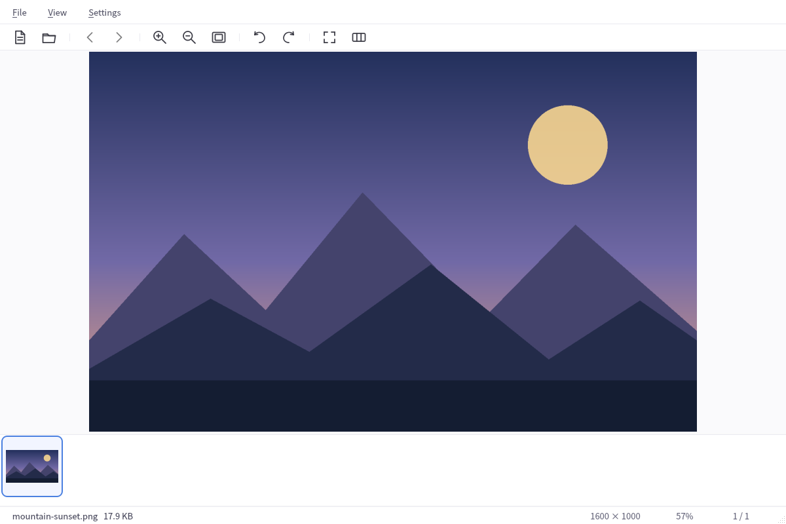
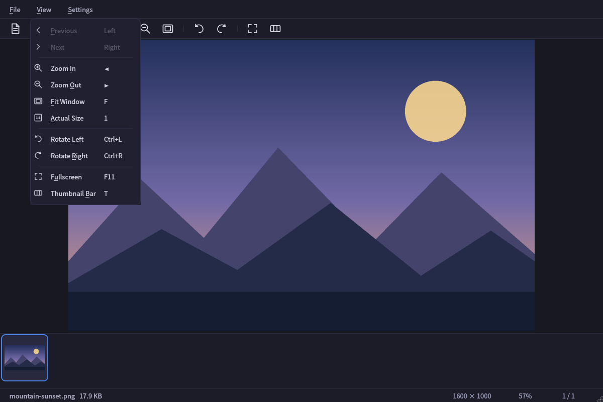
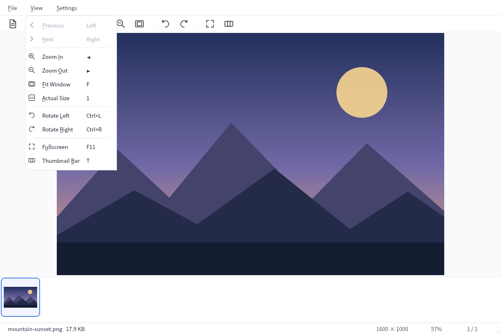

# FlashView

[English](README.md) | [简体中文](README.zh-CN.md) · [Changelog](CHANGELOG.md)

A fast, lightweight image & video viewer for Linux, built with Qt 6.

Browse folders with natural filename ordering, background thumbnail loading and
keyboard or mouse navigation. Large images shrink to fit the window; small images
stay at 100% until you choose to zoom in. The interface supports English and
Simplified Chinese, with dark and light themes.

## Screenshots

The screenshots below show the **English interface**. Both themes are shown
regardless of your browser's color scheme.

### Dark theme



### Light theme



<details>
<summary>View menu in both themes</summary>





</details>

## Quick start

Run these commands from the repository root on Debian/Ubuntu:

```bash
./scripts/install-deps.sh       # Install build tools and runtime plugins (sudo)
cmake -S . -B build -DCMAKE_BUILD_TYPE=Release
cmake --build build --parallel
./build/flashview               # Open the application
./build/flashview /path/to/image.png
./build/flashview /path/to/folder
```

You can also drop a file or folder onto the window, or press `Ctrl+O` to open a
file. To add FlashView to your application menu, install it for your user:

```bash
./install.sh --prefix ~/.local
```

For a system-wide install, use `./install.sh` (default prefix: `/usr/local`).
`./install.sh --deps` installs dependencies first. To uninstall, pass the same
prefix you used to install:

```bash
./install.sh --uninstall --prefix ~/.local
```

## Browsing and display

- **Folder browsing:** natural filename order (`photo2` before `photo10`), live
  folder updates, mouse-wheel paging and file/folder drag and drop.
- **Responsive previews:** background neighbour preloading, pixmap caching and
  progressive thumbnail decoding, with a horizontally scrolling filmstrip.
- **Image viewing:** smooth zoom and fade transitions, cursor-anchored
  `Ctrl` + wheel zoom, rotation and double-click to switch between fit and 100%.
  Automatic fitting shrinks large images without enlarging small ones.
- **Video controls:** play/pause, seeking, volume and mute, with remembered audio
  settings and playback error messages.
- **Interface:** dark/light themes, English/Chinese labels, coordinated toolbar
  and menu icons, plus fullscreen viewing with idle cursor hiding.

### Scaling quality

Choose **Settings → General → Scaling quality**:

- **Auto (recommended)**: smooth scaling for ordinary images; small, low-color
  images identified as pixel art use nearest neighbor when enlarged.
- **Smooth (photos)**: smooth scaling for photos and gradients.
- **Nearest neighbor (pixel art)**: keeps individual pixels sharply defined.

Static-image resampling starts in the background about 180 ms after zooming
stops. Animated images and very large images use realtime rendering to limit
extra work and memory use. This improves display smoothness; it does not recover
missing detail or perform AI upscaling. All modes preserve the default
shrink-to-fit behavior, and manual zoom can exceed 100%.

## Media formats and runtime support

**Images:** FlashView discovers formats from the installed Qt image decoders.
Common examples include JPEG, PNG, BMP, GIF, WebP, TIFF, SVG and ICO; the exact
list depends on the installed plugins. Animation playback is enabled when the
Qt image handler reports animation support.

**Optional formats:** APNG, AVIF, HEIF/HEIC, JPEG XL and camera RAW require
compatible Qt 6 image plugins. The dependency installer does not supply all of
these plugins. Installing a standalone codec library alone does not add a Qt
image handler; file extensions alone do not guarantee decoding or animation.

**Videos:** extensions come from the system MIME database, with content probing
for additional files. Playback uses Qt Multimedia and, on the Linux setup used
here, GStreamer. MP4, MKV, MOV, AVI or WebM containers can contain different
audio and video codecs, so appearing in the file list is not a playback guarantee.

At startup, a temporary status-bar message lists missing modern image handlers
and selected common video decoders. If a file fails to open, check its codec and
installed plugins, then restart FlashView after installing dependencies:

```bash
./scripts/install-deps.sh
```

## Keyboard & mouse

Common defaults are listed below. Navigation and viewing shortcuts can be
customized in **Settings → Shortcuts**; platform-specific Qt bindings may differ.
Ordinary wheel input pans a scrollable image and pages through files when the
image fits. General settings can change the wheel to zoom instead.

| Action | Shortcut |
| --- | --- |
| Next / previous file | `→` / `←`, mouse wheel, mouse back/forward buttons |
| First / last file | `Home` / `End` |
| Page through files | `PageDown` / `PageUp` |
| Zoom in / out | `Ctrl++` / `Ctrl+-`, `Ctrl` + wheel |
| Fit to window | `F` |
| Actual size (100%) | `1` (or click the zoom % in the status bar) |
| Rotate left / right | `Ctrl+L` / `Ctrl+R` |
| Play / pause video | `Space` |
| Adjust video volume | `Ctrl` + mouse wheel |
| Fullscreen | `F11` |
| Thumbnail bar | `T` |
| Open file / directory | `Ctrl+O` / `Ctrl+Shift+O` |
| Settings | `Ctrl+,` |

## Development and verification

### Dependencies

- CMake ≥ 3.16, a C++17 compiler
- Qt 6: Core, Gui, Widgets, Concurrent, Multimedia, MultimediaWidgets,
  LinguistTools and Test
- Qt SVG and image-format runtime plugins
- GStreamer Base, Good, Bad, Ugly and libav plugins (runtime video codecs)

The dependency script targets Debian/Ubuntu; CI is configured for Ubuntu 22.04,
24.04 and 26.04. It installs the build requirements and common runtime plugins:

```bash
./scripts/install-deps.sh        # interactive
./scripts/install-deps.sh -y     # non-interactive (CI)
```

### Build and test

```bash
./scripts/build.sh               # Release build into ./build
./scripts/build.sh --debug       # Debug build
```

For an existing build directory, use CMake directly to retain its generator:

```bash
cmake -S . -B build -DCMAKE_BUILD_TYPE=Release
cmake --build build --parallel
ctest --test-dir build --output-on-failure
```

### Regenerate the screenshots

The capture test embeds the same translation resources as the application and
checks the visible menu language. It uses temporary settings and a generated
sample image. Install a CJK font (for example, `fonts-noto-cjk` on Ubuntu) so
Chinese labels render correctly, then run:

```bash
QT_QPA_PLATFORM=offscreen QT_SCALE_FACTOR=1 QT_FONT_DPI=96 \
FLASHVIEW_SCREENSHOT_DIR="$PWD/screenshots" \
./build/flashview_tests generateDocumentationScreenshots
```

This generates eight 1200 × 800 PNG files named
`screenshots/flashview-{en,zh}-{dark,light}.png` and
`screenshots/flashview-{en,zh}-{dark,light}-menu.png`. Each README references only
its own interface language. Font and Qt versions can affect the exact rendering.

### Continuous integration

Every push and pull request runs the Qt regression suite, an offscreen launch
smoke test and an install-layout check on Ubuntu 22.04, 24.04 and 26.04 via
GitHub Actions — see [.github/workflows/build.yml](.github/workflows/build.yml).

## Project layout

```bash
src/            C++ sources (MainWindow, ImageViewer, VideoPlayer,
                ThumbnailBar, ThemeManager, SettingsDialog)
i18n/           Qt Linguist translations (en, zh)
resources/      Icons and Qt resource files
screenshots/    English/Chinese captures in both themes
scripts/        Dependency installer and build script
tests/          Qt Test regression suite
.github/        CI workflows
CHANGELOG.md    User-visible change history
```

## License

No license file yet — all rights reserved by the author until one is added.
