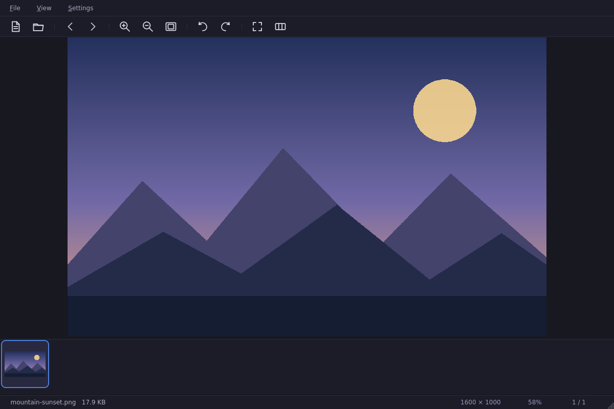
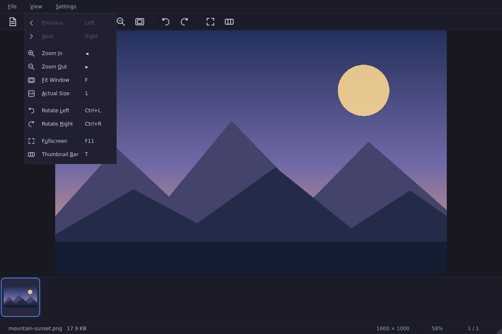

# FlashView

[English](README.md) | [简体中文](README.zh-CN.md) · [更新日志](CHANGELOG.md)

FlashView 是一款基于 Qt 6 开发的快速、轻量级 Linux 图片与视频浏览器。

它专注于流畅浏览包含大量图片的文件夹：支持相邻图片预加载、平滑缩放与
淡入动画、胶片式缩略图栏、深浅主题以及完整的键盘和鼠标导航。

## 界面截图

<p align="center">
  <picture>
    <source media="(prefers-color-scheme: dark)" srcset="screenshots/flashview-dark.png">
    <source media="(prefers-color-scheme: light)" srcset="screenshots/flashview-light.png">
    
  </picture>
</p>

<p align="center">
  
</p>

## 功能特性

- **图片格式**：根据运行时已安装的 Qt 解码器动态发现；通常支持 JPEG、PNG、
  BMP、GIF 动图、WebP、TIFF、SVG 和 ICO，安装相应 Qt 图片插件后还可支持
  APNG、AVIF、HEIF/HEIC、JPEG XL 与相机 RAW
- **视频格式**：扩展名来自系统 MIME 数据库，并根据文件内容探测；通过
  Qt Multimedia 与已安装的 GStreamer codec 播放
- 针对鼠标和触控板优化的平滑滚轮翻页
- 相邻图片后台预加载与像素图缓存，往返浏览更加迅速
- 大型文件夹缩略图异步渐进加载，不阻塞主界面
- 文件名自然排序（例如 `photo2` 排在 `photo10` 前）与文件夹实时刷新
- 平滑缩放动画、以光标为中心的 `Ctrl` + 滚轮缩放
- 双击在适应窗口与 100% 原始大小之间切换
- 图片淡入切换，窗口尺寸改变时自动重新适配
- 支持平滑横向滚动和自动居中的胶片式缩略图栏
- 图片旋转、沉浸式全屏、文件和文件夹拖放
- 清晰的空目录与错误状态，不会残留旧图片或后台视频声音
- 视频进度、音量和静音控制，并记忆音量设置
- 风格统一、比例协调且支持 HiDPI 的工具栏和菜单图标
- 深色与浅色主题，支持英文和简体中文界面

## 键盘与鼠标操作

| 操作 | 快捷键 |
| --- | --- |
| 下一个 / 上一个文件 | `→` / `←`、鼠标滚轮、鼠标前进/后退键 |
| 第一个 / 最后一个文件 | `Home` / `End` |
| 向前 / 向后翻页 | `PageDown` / `PageUp` |
| 放大 / 缩小 | `Ctrl++` / `Ctrl+-`、`Ctrl` + 滚轮 |
| 适应窗口 | `F` |
| 原始大小（100%） | `1`，或单击状态栏中的缩放比例 |
| 向左 / 向右旋转 | `Ctrl+L` / `Ctrl+R` |
| 播放 / 暂停视频 | `Space` |
| 调整视频音量 | `Ctrl` + 鼠标滚轮 |
| 全屏 | `F11` |
| 切换缩略图栏 | `T` |
| 打开文件 / 文件夹 | `Ctrl+O` / `Ctrl+Shift+O` |
| 设置 | `Ctrl+,` |

## 依赖

- CMake ≥ 3.16 和支持 C++17 的编译器
- Qt 6：Core、Gui、Widgets、Concurrent、Multimedia、
  MultimediaWidgets、LinguistTools 和 Test
- Qt SVG 与图片格式运行时插件
- GStreamer Base、Good、Bad、Ugly 与 libav 插件（视频运行时 codec）

在 Debian/Ubuntu 22.04、24.04 或 26.04 上可直接安装全部依赖：

```bash
./scripts/install-deps.sh        # 交互式安装
./scripts/install-deps.sh -y     # 非交互式安装（适用于 CI）
```

## 构建

```bash
./scripts/build.sh               # Release 构建，输出到 ./build
./scripts/build.sh --debug       # Debug 构建
./scripts/build.sh --clean       # 构建前清理构建目录
```

也可以手动执行：

```bash
cmake -S . -B build -DCMAKE_BUILD_TYPE=Release
cmake --build build --parallel
ctest --test-dir build --output-on-failure
./build/flashview [文件或文件夹]
```

从真实 Qt 界面重新生成文档截图：

```bash
QT_QPA_PLATFORM=offscreen \
FLASHVIEW_SCREENSHOT_DIR="$PWD/screenshots" \
./build/flashview_tests generateDocumentationScreenshots
```

## 安装

```bash
./install.sh                     # 构建并安装到 /usr/local
./install.sh --prefix ~/.local   # 安装到当前用户目录，无需 sudo
./install.sh --deps              # 先安装依赖，再构建和安装
./install.sh --uninstall         # 卸载
```

安装内容包括 `flashview` 可执行文件、桌面入口和应用图标。安装完成后可在
应用程序菜单中找到 FlashView。

## 持续集成

每次推送和拉取请求都会在 Ubuntu 22.04、24.04 和 26.04 上运行 Qt
回归测试、离屏启动测试以及安装目录检查。工作流位于
[.github/workflows/build.yml](.github/workflows/build.yml)。

## 项目结构

```text
src/            C++ 源码
i18n/           Qt Linguist 中英文翻译
resources/      图标与 Qt 资源
screenshots/    可复现的深色/浅色界面截图
scripts/        依赖安装与构建脚本
tests/          Qt Test 回归测试
.github/        CI 工作流
CHANGELOG.md    面向用户的更新记录
```

## 许可证

项目暂未包含许可证文件。在添加许可证前，作者保留全部权利。
