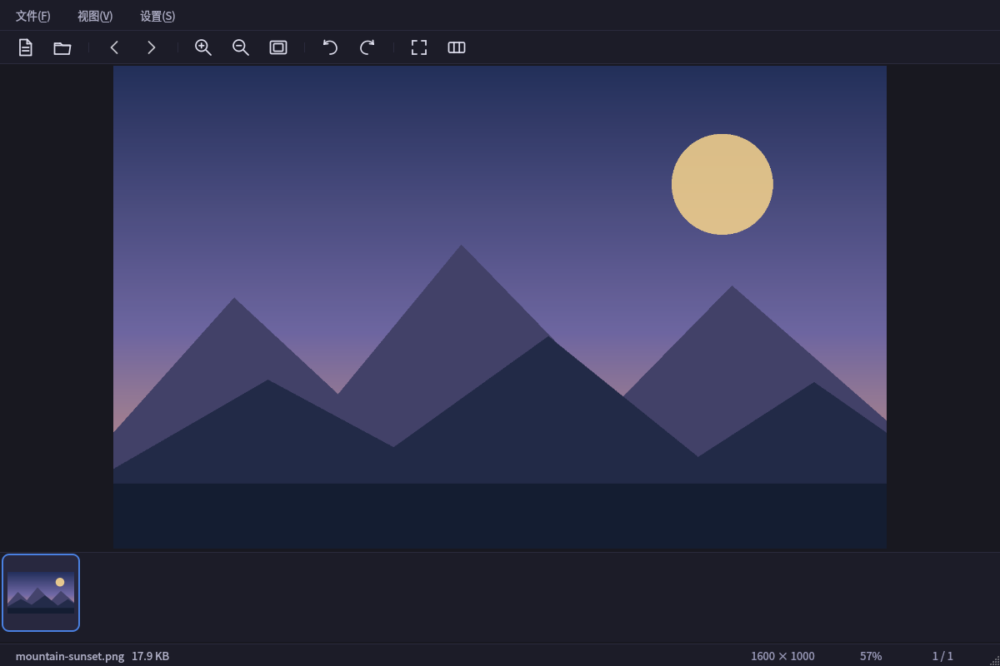
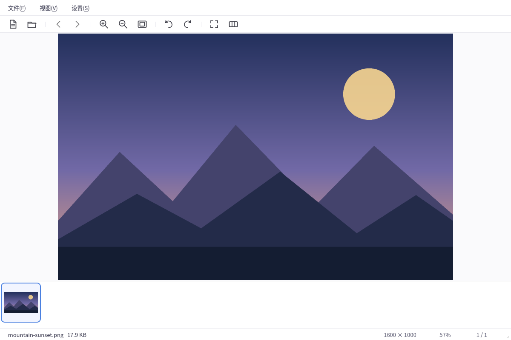
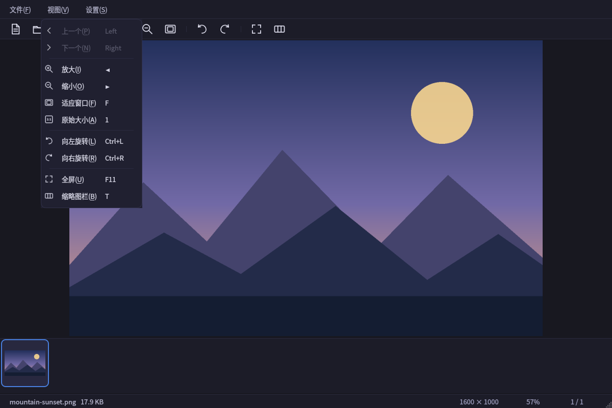
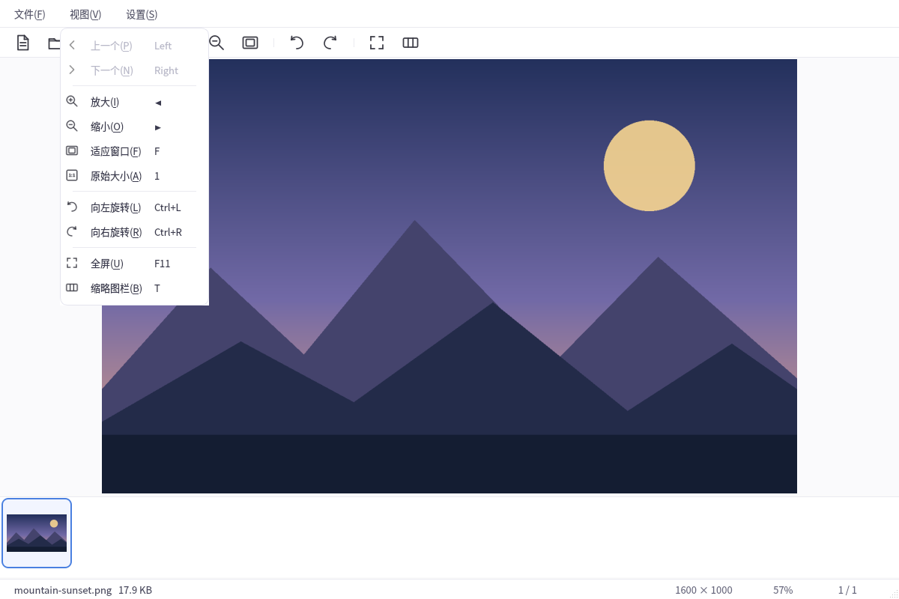

# FlashView

[English](README.md) | [简体中文](README.zh-CN.md) · [更新日志](CHANGELOG.md)

FlashView 是一款基于 Qt 6 开发的快速、轻量级 Linux 图片与视频浏览器。

支持文件名自然排序、后台缩略图加载，以及键盘和鼠标浏览。大图自动缩小以完整
显示，小图默认保持 100%，需要时可手动放大。界面提供简体中文、英文，以及
深色和浅色两种主题。

## 界面截图

以下截图均为**简体中文界面**。两种主题同时展示，不随浏览器的配色设置隐藏。

### 深色主题



### 浅色主题



<details>
<summary>查看两种主题的视图菜单</summary>





</details>

## 快速开始

在 Debian/Ubuntu 上，从项目根目录执行：

```bash
./scripts/install-deps.sh       # 安装构建工具和运行时插件，需要 sudo
cmake -S . -B build -DCMAKE_BUILD_TYPE=Release
cmake --build build --parallel
./build/flashview               # 打开应用
./build/flashview /path/to/image.png
./build/flashview /path/to/folder
```

也可以把文件或文件夹拖入窗口，或按 `Ctrl+O` 打开文件。若要在应用程序菜单中
找到 FlashView，可安装到当前用户目录：

```bash
./install.sh --prefix ~/.local
```

系统级安装使用 `./install.sh`，默认目录为 `/usr/local`；
`./install.sh --deps` 会先安装依赖。卸载时使用与安装时一致的目录：

```bash
./install.sh --uninstall --prefix ~/.local
```

## 浏览与显示

- **文件夹浏览：**文件名自然排序（例如 `photo2` 排在 `photo10` 前）、文件夹
  实时刷新、滚轮翻页，以及文件和文件夹拖放。
- **流畅预览：**相邻图片后台预加载、像素图缓存、缩略图渐进解码，以及支持
  横向滚动的胶片式缩略图栏。
- **图片查看：**平滑缩放与淡入动画、以光标为中心的 `Ctrl` + 滚轮缩放、旋转，
  双击切换适应窗口与 100%。自动适配只缩小大图，不放大小图。
- **视频控制：**播放与暂停、进度跳转、音量与静音，记忆音频设置并提示播放错误。
- **界面：**深浅主题、中英文文字、风格协调的工具栏和菜单图标，以及空闲时
  自动隐藏光标的全屏查看模式。

### 缩放质量

在**偏好设置 → 常规 → 缩放质量**中选择：

- **自动（推荐）**：普通图片平滑缩放；小尺寸、低色数图片被识别为像素画后，
  放大时使用最近邻。
- **平滑（照片）**：适合照片和渐变图片。
- **最近邻（像素画）**：保持单个像素的清晰边界。

静态图片在停止缩放约 180 ms 后进行后台重采样。动图与超大图片使用实时渲染，
控制额外计算量和内存占用。这能改善显示平滑度，但不会恢复原图中缺失的细节，
也不属于 AI 超分辨率。所有模式均保持默认只缩小、不放大的适配规则，手动缩放
仍可超过 100%。

## 媒体格式与运行时支持

**图片：**根据已安装的 Qt 图片解码器发现格式。常见格式包括 JPEG、PNG、BMP、
GIF、WebP、TIFF、SVG 和 ICO，实际列表取决于本机插件。Qt 图片处理器报告支持
动画时，应用才会启用动画播放。

**可选格式：**APNG、AVIF、HEIF/HEIC、JPEG XL 和相机 RAW 需要兼容 Qt 6 的
图片插件。依赖安装脚本不包含全部这些插件。仅安装底层编解码库不会自动增加
Qt 图片处理器，文件扩展名也不能保证能够解码或播放动画。

**视频：**扩展名来自系统 MIME 数据库，并通过内容探测识别其他文件。播放由
Qt Multimedia 处理，本项目的 Linux 环境使用 GStreamer。MP4、MKV、MOV、AVI
或 WebM 容器可以包含不同的音视频编码，因此出现在文件列表中不代表一定能播放。

启动时，状态栏会短暂提示缺少的现代图片处理器及部分常见视频解码器。无法打开
文件时，请检查文件编码和插件安装情况；安装依赖后重启 FlashView：

```bash
./scripts/install-deps.sh
```

## 键盘与鼠标操作

以下为常见默认快捷键。浏览与显示相关快捷键可在**偏好设置 → 快捷键**中修改，
Qt 的平台默认绑定可能有所不同。普通滚轮在图片可滚动时滚动图片，在图片完整
显示时翻页；也可在常规设置中将滚轮改为缩放。

| 操作 | 快捷键 |
| --- | --- |
| 下一个 / 上一个文件 | `→` / `←`、鼠标滚轮、鼠标前进/后退键 |
| 第一个 / 最后一个文件 | `Home` / `End` |
| 向前 / 向后翻页 | `PageDown` / `PageUp` |
| 放大 / 缩小 | `Ctrl++` / `Ctrl+-`、`Ctrl` + 滚轮 |
| 适应窗口 | `F` |
| 原始大小（100%） | `1`，或单击状态栏中的缩放比例 |
| 向左 / 向右旋转 | `Ctrl+L` / `Ctrl+R` |
| 播放 / 暂停视频 | `Space` |
| 调整视频音量 | `Ctrl` + 鼠标滚轮 |
| 全屏 | `F11` |
| 切换缩略图栏 | `T` |
| 打开文件 / 文件夹 | `Ctrl+O` / `Ctrl+Shift+O` |
| 设置 | `Ctrl+,` |

## 开发与验证

### 依赖

- CMake ≥ 3.16 和支持 C++17 的编译器
- Qt 6：Core、Gui、Widgets、Concurrent、Multimedia、
  MultimediaWidgets、LinguistTools 和 Test
- Qt SVG 与图片格式运行时插件
- GStreamer Base、Good、Bad、Ugly 与 libav 插件（视频运行时 codec）

依赖脚本面向 Debian/Ubuntu，CI 配置覆盖 Ubuntu 22.04、24.04 和 26.04。
脚本安装构建依赖与常见运行时插件：

```bash
./scripts/install-deps.sh        # 交互式安装
./scripts/install-deps.sh -y     # 非交互式安装（适用于 CI）
```

### 构建与测试

```bash
./scripts/build.sh               # Release 构建，输出到 ./build
./scripts/build.sh --debug       # Debug 构建
```

已有构建目录时，可直接使用 CMake，沿用该目录的构建生成器：

```bash
cmake -S . -B build -DCMAKE_BUILD_TYPE=Release
cmake --build build --parallel
ctest --test-dir build --output-on-failure
```

### 重新生成截图

截图测试与应用嵌入同一组翻译资源，并校验实际显示的菜单语言。测试使用临时
设置和程序生成的示例图片。请先安装中文字体（例如 Ubuntu 上的
`fonts-noto-cjk`），确保文字正常渲染，然后执行：

```bash
QT_QPA_PLATFORM=offscreen QT_SCALE_FACTOR=1 QT_FONT_DPI=96 \
FLASHVIEW_SCREENSHOT_DIR="$PWD/screenshots" \
./build/flashview_tests generateDocumentationScreenshots
```

该命令生成八张 1200 × 800 的 PNG：
`screenshots/flashview-{en,zh}-{dark,light}.png` 和
`screenshots/flashview-{en,zh}-{dark,light}-menu.png`。每份 README 只引用对应
界面语言的截图。字体和 Qt 版本的差异可能影响具体渲染效果。

### 持续集成

每次推送和拉取请求都会在 Ubuntu 22.04、24.04 和 26.04 上运行 Qt
回归测试、离屏启动测试以及安装目录检查。工作流位于
[.github/workflows/build.yml](.github/workflows/build.yml)。

## 项目结构

```text
src/            C++ 源码
i18n/           Qt Linguist 中英文翻译
resources/      图标与 Qt 资源
screenshots/    中文/英文界面的深色与浅色截图
scripts/        依赖安装与构建脚本
tests/          Qt Test 回归测试
.github/        CI 工作流
CHANGELOG.md    面向用户的更新记录
```

## 许可证

项目暂未包含许可证文件。在添加许可证前，作者保留全部权利。
